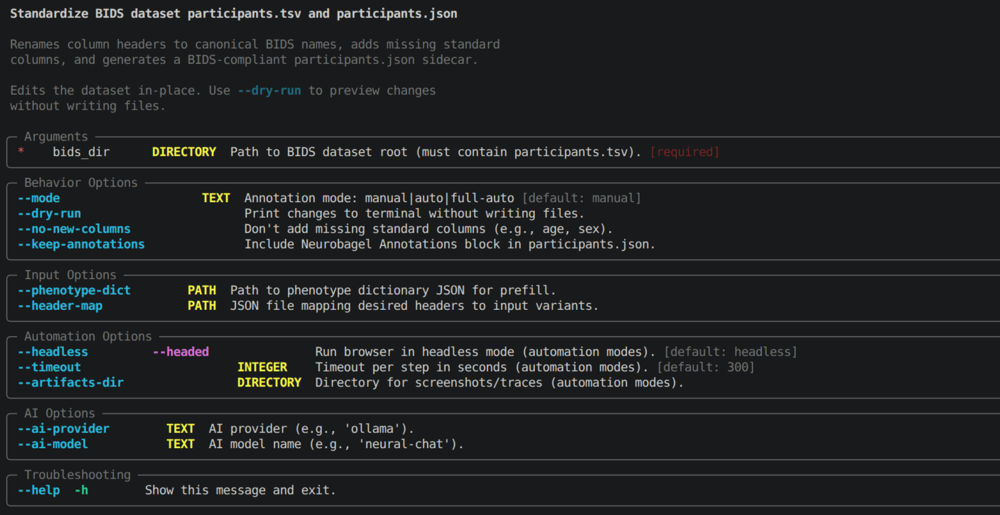
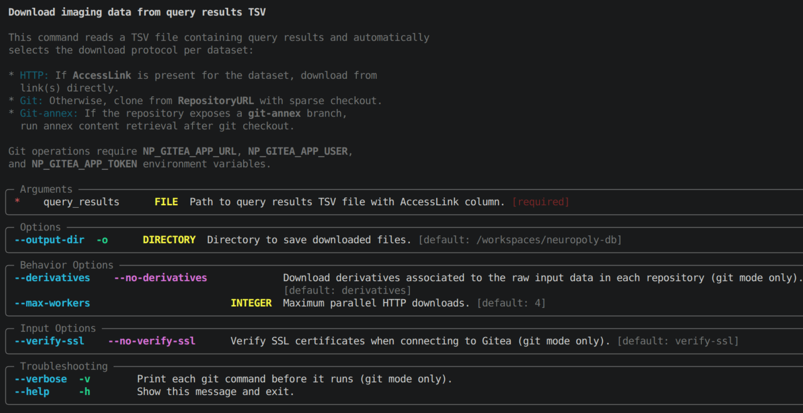
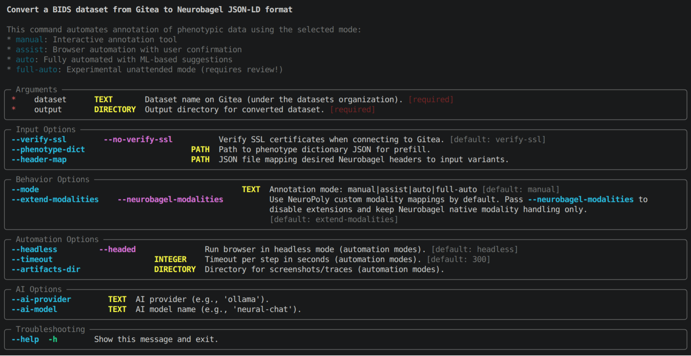

# NEUROPOLY DATABASE EXPLORATION AND STANDARDIZATION TOOLS

This repository hosts a collection of tools to interact with **metadata contained in the several NEUROPOLY databases**.

- Parsing and standardization of [BIDS](https://bids.neuroimaging.io) datasets
- Automatic conversion of BIDS datasets for ingestion in a [NeuroBagel](https://neurobagel.org) graph database
- Automated download of [NeuroGitea](https://data.neuro.polymtl.ca) datasets from [NeuroBagel](https://neurobagel.org) queries

> _Main Goal_
> Provide exploration tools into every database, agnostic to the data structure (standard) and management software (e.g. DataLad, Git, etc.) used to store the data.

## `npdb` command line tool

The **N**euro**P**oly **D**atabase **B**rowser is a python command line tool **simplifies interaction** with the many databases **hosting technologies** ([NeuroGitea](https://data.neuro.polymtl.ca), [NeuroBagel](https://neurobagel.org), etc.) used at NeuroPoly and their associated **data standards** ([DICOM](https://www.dicomstandard.org), [Nifti](https://nifti.nimh.nih.gov), [BIDS](https://bids.neuroimaging.io/index.html), etc.). It offers, among others, the following functionalities :

- [Standardization of BIDS datasets](#npdb-standardize-bids-options-dataset) to a common NeuroPoly vocabulary and structure.
- [Download of datasets from NeuroGitea](#npdb-download-options-dataset-output) using NeuroBagel queries.
- [Conversion of NeuroGitea datasets to NeuroBagel](#npdb-gitea2bagel-options-dataset-output) format for ingestion in a NeuroBagel graph database.

All `npdb` commands are **interactive by default** and require user input to proceed. However, most of them also offer **assited** and **automated** modes to reduce (even replace) user interaction and speed up the process. Refer to the [commands descriptions](#commands) below for more details.

> [!IMPORTANT]
> **New users are strongly encouraged to read the [usage guides](#usage-guides) before using the CLI.**

### Prerequisites

- Install [Python 3.12+](https://www.python.org/downloads/)
- Install [uv](https://docs.astral.sh/uv/getting-started/installation/)

### Installation

> [!IMPORTANT]
> **To use the `download` functionalities, you'll need to query from NeuroBagel (unless you already have the query results you need). Until an official NeuroBagel node is deployed at NeuroPoly, you need to install a local NeuroBagel node to query datasets from**.
>
> Follow the steps in [this documentation](./docs/neurobagel/user_install.md) to install and furnish a local NeuroBagel node.

0. If not done already, **clone or download this repository** to your local machine. Then, **open a terminal** and navigate to its root.

1. Create a **new virtual environment** locally to host the CLI dependencies and libraries :

   ```bash
   uv venv .venv
   ```

   Answer `yes` if you see :

   ```bash
   A virtual environment already exists at .venv. Do you want to replace it?
   ```

   The above command _might fail if some virtual environment has already been configured in the provided directory (.venv)_. If you experience issues, **delete the content** under the virtual environment's directory and **re-run the command**.

2. **Synchronize the virtual environment** with the CLI dependencies :

   ```bash
   uv sync --active
   ```

3. (Optional) If you intend on using the **assisted or automated modes** for BIDS standardization and conversion to NeuroBagel (see commands below), you need to **install additional dependencies**. Run the following commands to install them :

    ```bash
    uv sync --active --quiet --extra annotation-automation
    uv run playwright install --with-deps chromium
    ```

### Usage guides

- [**Download BIDS datasets from NeuroGitea using NeuroBagel queries**](./docs/npdb/download/guides/neurobagel_query.md)

  This guide explains how to :
  
  - **query datasets** using the `NeuroBagel` web interface,
  - **save the query results** to file and interpret them,
  - **download the query results** from `NeuroGitea` using `npdb`

### Commands

#### `npdb standardize bids [options] <dataset>`

##### [🢖 Standardization options and customization](./docs/npdb/standardize/bids/extended.md)



#### `npdb download [options] <query-results.tsv>`

##### [🢖 **Guide**: download from NeuroBagel queries](./docs/npdb/download/guides/neurobagel_query.md)



#### `npdb gitea2bagel [options] <dataset> <output>`

##### [🢖 Annotation and standardization modes](./docs/npdb/gitea2bagel/extended.md)



### Developer guide

#### Developer installation

First, run the [installation procedure above](#installation). Then, install the full development environment using :

```bash
uv sync --active --quiet --all-extras
```

#### Components

- **Database exploration**
  
  Complete and structured deployment of a local [NeuroBagel](https://github.com/neurobagel) node, extended with NeuroPoly-specific imaging modality vocabulary :

  - [NeuroBagel deployment](./docs/neurobagel/install.md)
  - [NeuroBagel extensions](./docs/neurobagel/extensions.md)
  - [NeuroBagel management](./docs/neurobagel/manage.md)

- **Database ingestion**

  A set of command line tools (under `npdb`) to ingest data into a local _NeuroBagel_ node (currently supports `Neurogitea` indexed databases only):

  - [NeuroGitea database ingestion](./docs/npdb/ingestion.md)

- **Metadata standardization**
  
  A set of command line tools (under `npdb standardize`) to manipulate common standards (e.g. BIDS, Bagel).

  - [BIDS datasets standardization](./docs/npdb/standardization.md)
