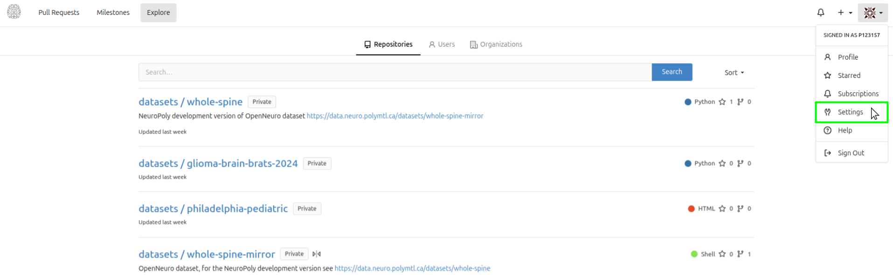
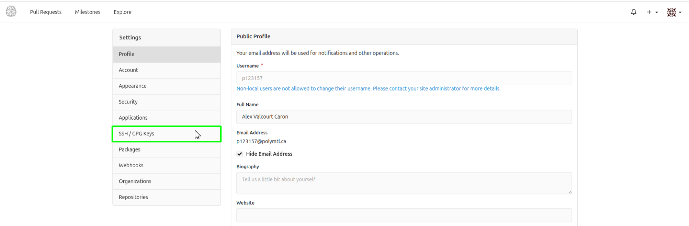
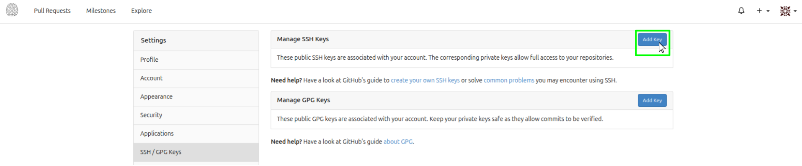
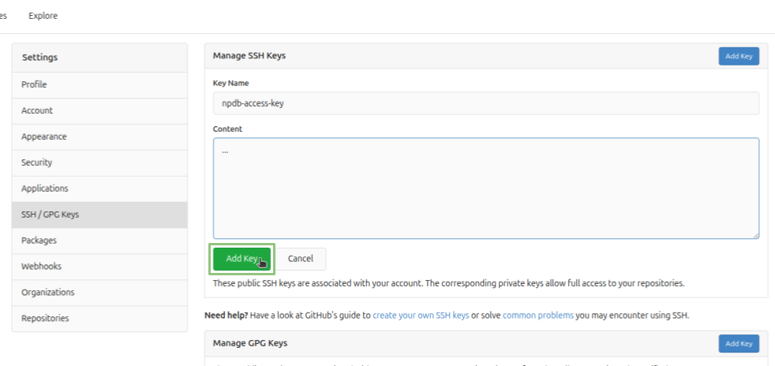
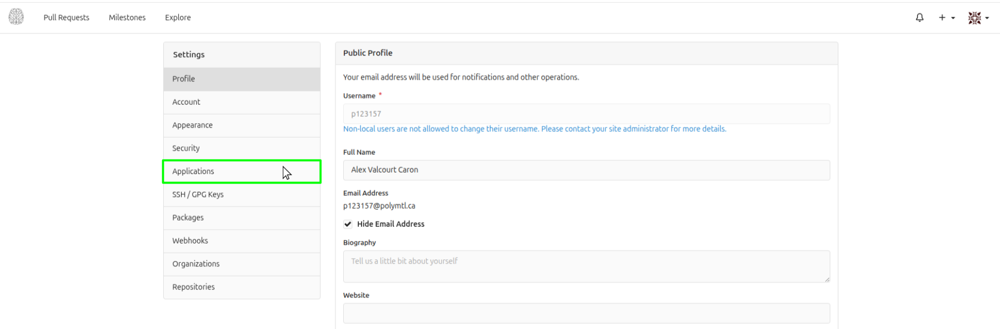
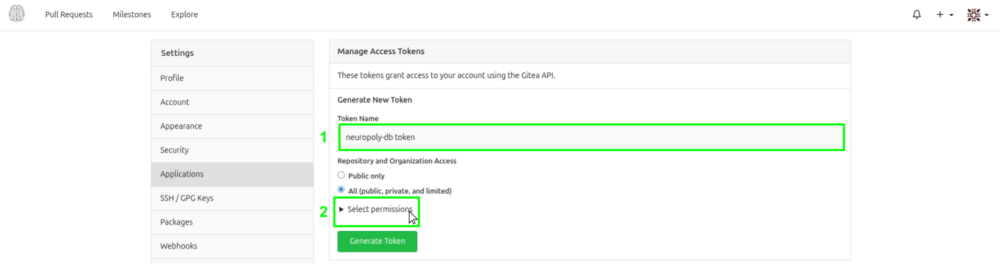
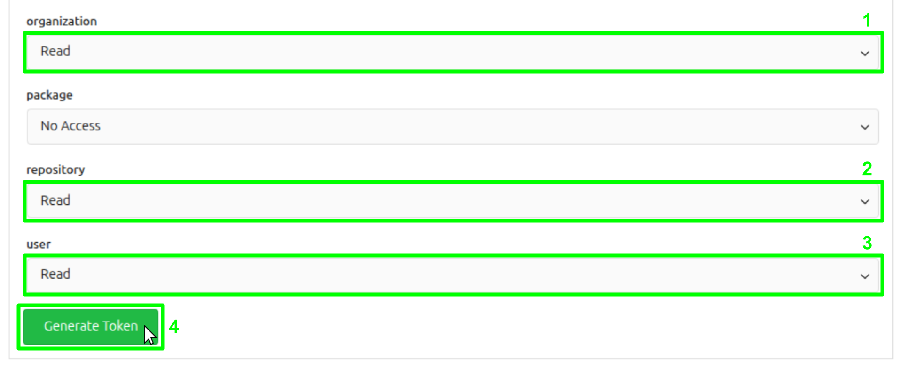
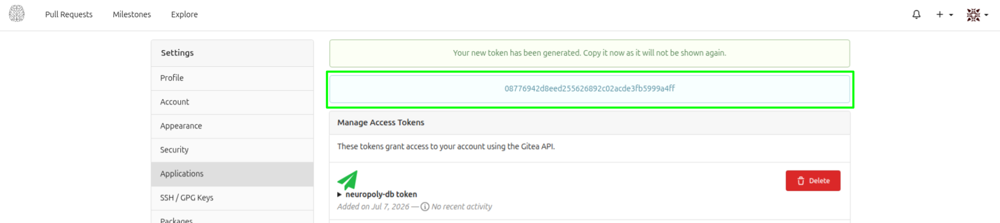

# NeuroGitea account setup

Follow the instructions below to configure your account on the [neurogitea website](https://data.neuro.polymtl.ca) (you need to activate the VPN if accessing from outside the Polytechnique network). **If you don't have an account yet, contact the [NeuroPoly IT support](https://github.com/orgs/neuropoly/teams/ansible-admins) to create one (via slack is the quickest).**

1. Log into [NeuroGitea](https://data.neuro.polymtl.ca) with your account.

2. Open the user settings by clicking on your profile picture at the top right of the page, then click on **Settings**.

   

## SSH key registration

> [!IMPORTANT]
> A new SSH key must be registered **for each machine used to access the data**.

**On your computer (or the one you want to give access to NeuroGitea) :**

0. First, verify if your machine is already registered with NeuroGitea. Activate the VPN if not already done, then run the following command in your terminal:

   ```bash
   ssh git@data.neuro.polymtl.ca
   ```

   If successful, you'll see the following message :

   ```text
   PTY allocation request failed
   Hi there, "$USER"! You've successfully authenticated with the key named "$EMAIL", but Gitea does not provide shell access.
   If this is unexpected, please log in with password and setup Gitea under another user.
   Shared connection to data.neuro.polymtl.ca closed.
   ```

1. If not successful, verify if you already own a valid SSH key by running the following command in your terminal:

   ```bash
   ls ~/.ssh/id_ed25519.pub
   ```

   > **If you see a file path printed in the terminal, you already have a valid SSH key. You can go to step 3.**

2. **You don't have an ssh key.** Generate a new one using `ssh-keygen` :

   ```bash
   ssh-keygen -t ed25519
   ```

   > P**ress `Enter` to accept the default file location and leave the passphrase empty.** The command will create 2 new files in your `~/.ssh` directory: `id_ed25519` (private key) and `id_ed25519.pub` (public key). 

**Back on the NeuroGitea website, in the settings page :**

3. In the left sidebar of NeuroGitea, click on **SSH / GPG Keys**.

   

4. On the **right of `Manage SSH Keys`**, click on **Add Key**.

   

5. Copy the **public key** (`id_ed25519.pub`, or the name you chose above) from your computer and paste it in the **`content`** field on the NeuroGitea website. **Either naviaguate to `~/.ssh`, open the file with a text editor and copy its content, or copy the value from the terminal after running :**

   ```bash
   cat ~/.ssh/id_ed25519.pub
   ```

6. Click on **Add Key** to register your SSH key.

   

## Access token generation

1. In the left sidebar, click on **Applications**.

   

2. Give a name to your token (e.g. `neuropoly-db token`) and click on `Select permissions` to unwrap the permissions menu.

   

3. Select `Read` permissions for the **organization**, **repository** and **user** scopes. Then, click `Generate Token` below the permissions menu.

   

4. Copy the generated token and save it somewhere safe. **It's the only time you'll be able to see it**.

   

5. Edit the `neuropoly-db/.env` file and add your NeuroGitea username and the copied token here:
   ```bash
   NP_GITEA_APP_USER=
   NP_GITEA_APP_TOKEN=
   ```

6. Validate that your connection to NeuroGitea is functional:
   ```bash
   ssh git@data.neuro.polymtl.ca
   ```

   If successful, you should be seeing this:
   ```text
   PTY allocation request failed
   Hi there, "$USER"! You've successfully authenticated with the key named "$EMAIL", but Gitea does not provide shell access.
   If this is unexpected, please log in with password and setup Gitea under another user.
   Shared connection to data.neuro.polymtl.ca closed.
   ```
